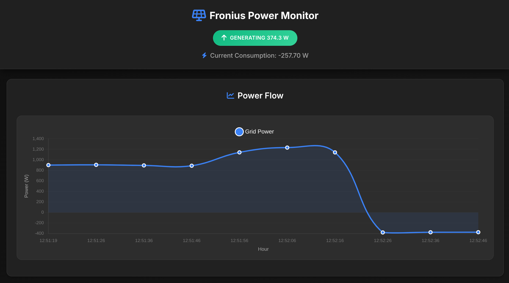

# Fronius Solar Power Monitor

A web-based monitoring application for Fronius solar inverters that provides real-time and historical power generation/consumption data visualization.



## Features

- Real-time power monitoring
- Historical data visualization with interactive charts
- Cost calculation based on power import/export rates
- Responsive web interface
- Automatic data collection every 10 seconds
- Local database storage for historical analysis

## Prerequisites

- Python 3.8 or higher
- Fronius inverter on the same network
- Network access to the inverter's API endpoint

## Installation

1. Clone this repository:
```bash
git clone https://github.com/josh-abram/fronius-solar-monitor
cd fronius-monitor
```

2. Install required dependencies:
```bash
pip install -r requirements.txt
```

3. Configure your inverter's IP address:
   - Open `fronius.py`
   - Update the `INVERTER_IP` constant with your Fronius inverter's local IP address

## Usage

1. Start the application:
```bash
python fronius.py
```

2. Access the web interface:
   - Open your browser and navigate to `http://localhost:80`
   - For remote access within your network, use your machine's IP address

## Configuration

### Power Rates
Current power rates are set to:
- Import from grid: $0.297 per kWh
- Export to grid: $0.035 per kWh credit

To modify these rates, update the values in the `historical_data` function in `fronius.py`.

### Timezone
The application is currently set to 'Australia/Sydney' timezone. To change this:
1. Locate the timezone setting in `fronius.py`
2. Replace 'Australia/Sydney' with your desired timezone

## Data Storage

The application uses SQLite for data storage:
- Database file: `power_data.db`
- Automatic table creation on first run
- Stores timestamp, grid power, load power, and status

## Contributing

Contributions are welcome! Please feel free to submit a Pull Request.

## Acknowledgments

- Built using Flask web framework
- Uses Chart.js for data visualization
- Designed for Fronius inverters using their Solar API